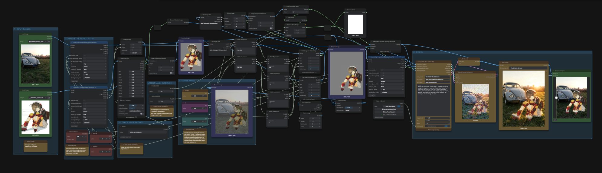
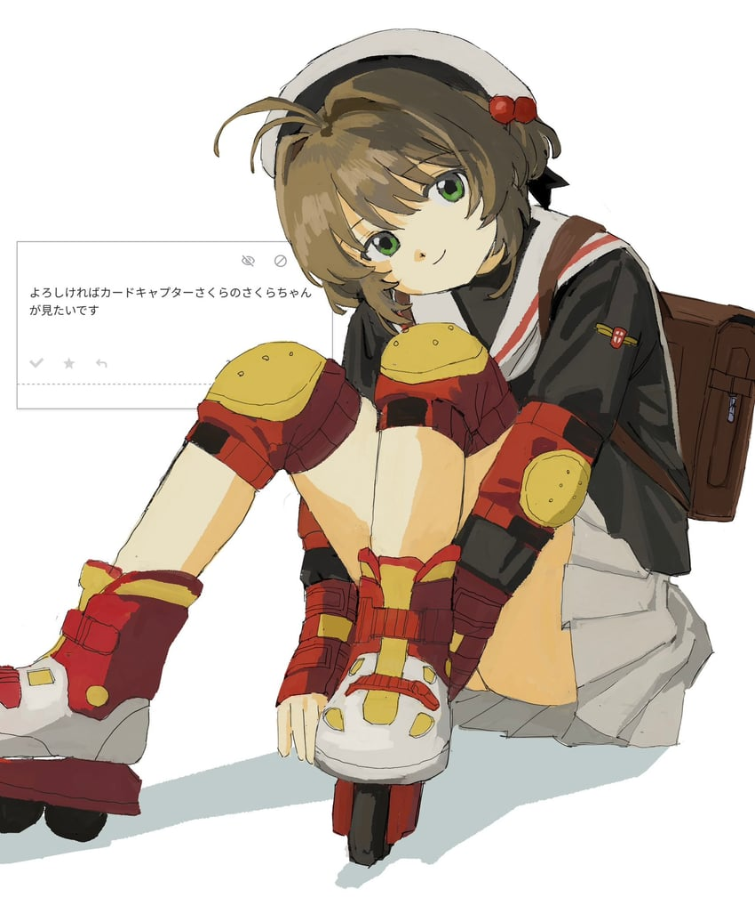
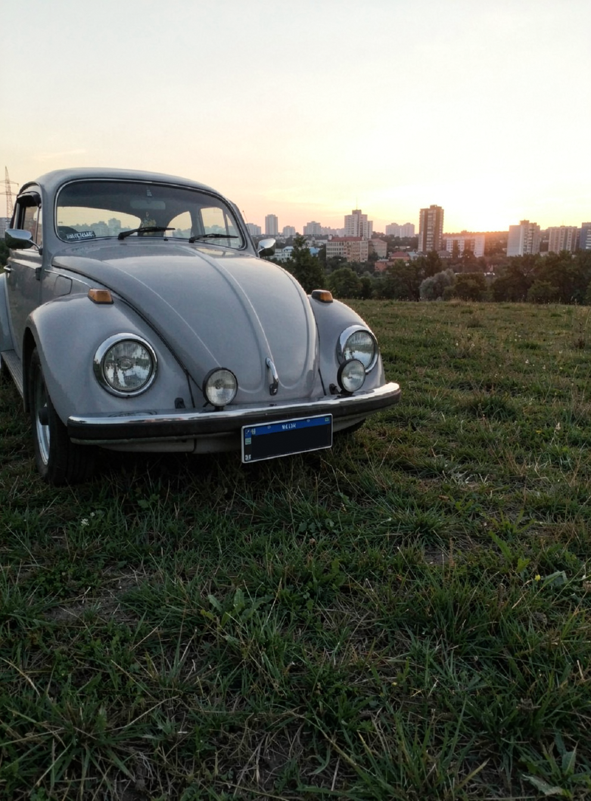
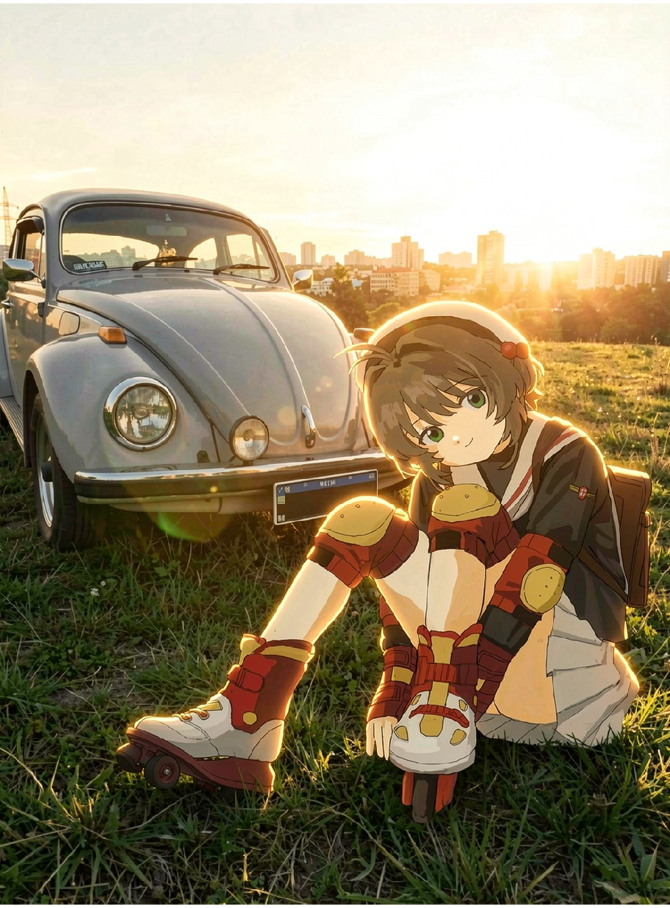

# AnimeIRL-ComfyUI-Workflow

A ComfyUI workflow that takes a drawing — it behaves best on anime art — cuts the character out with **SAM 3.1**, composites them into a real photograph, and uses **FLUX.2 Klein 9B** to relight and blend the two so the result reads as a photo of the character actually standing there.

Inspired by the anime-into-real-life edits from [@auhuheben17](https://x.com/auhuheben17).

**Workflow file:** `AnimeIRL-ComfyUI-Workflow.json`



---

## Example
  
| Image1 | Image2 | Flux.2 Klein output |
|---|---|---|
|  |  |  |
 >  Art by [蘇我](https://x.com/ool_x4)
---

## What it does

 
1. You provide two images: a **character** drawing and a **background** photo/scene.
2. The character is segmented with SAM‑3 using a short text prompt.
3. You change the character's zoom/position over the background using a preview, until it sits where you want it in the final shot.
4. Both images go into **Flux.2 Klein 9B** as reference latents alongside a text prompt describing the final scene. The model composites, relights, and blends the character into the background in one pass.

With this workflow the character doesn't have to be regenerated from scratch. SAM masks them out of the drawing, you position them by hand over the photo with three number widgets, and the two images are composited **before** anything is sampled. Flux receives that composite as its starting latent, plus both source images as references, and a per-region denoise map that says exactly how much it is allowed to touch the character versus the background.


---

## Requirements

- **ComfyUI ≥ 0.19.3.** The graph needs native `SAM3_Detect`, the FLUX.2 nodes (`Flux2Scheduler`, `ReferenceLatent`), the newer core image nodes (`ResizeAndPadImage`, `ImageCompare`, `ComfyMathExpression`), and frontend subgraph support. Saved on frontend `1.47.11`, schema `0.4`.
- **~16 GB VRAM** comfortable. Klein 9B fp8 plus the Qwen3-8B fp8 text encoder is roughly 17–18 GB of weights, so 12 GB works with offloading but expect swapping.
- Sampling itself is cheap: **6 steps, CFG 1** on the distilled Klein.

## Models

| Role | File | Folder | Source |
|---|---|---|---|
| Diffusion model | `flux-2-klein-9b.safetensors` (fp8) | `models/diffusion_models/` | [BFL FLUX.2-klein-9b-fp8](https://huggingface.co/black-forest-labs/FLUX.2-klein-9b-fp8) |
| Text encoder | `qwen_3_8b_fp8mixed.safetensors` | `models/text_encoders/` | [Comfy-Org/flux2-klein-9B](https://huggingface.co/Comfy-Org/flux2-klein-9B/blob/main/split_files/text_encoders/qwen_3_8b_fp8mixed.safetensors) |
| VAE | `flux2-vae.safetensors` | `models/vae/` | [Comfy-Org/flux2-dev](https://huggingface.co/Comfy-Org/flux2-dev/blob/main/split_files/vae/flux2-vae.safetensors) |
| Segmentation | `sam3.1_multiplex_fp16.safetensors` | `models/checkpoints/` | [Comfy-Org/sam3.1](https://huggingface.co/Comfy-Org/sam3.1) |

Notes:

- The `CLIPLoader` type is set to **`flux2`** — Qwen3-8B is loaded as the FLUX.2 text encoder, not as a Qwen image model.
- The saved graph points at `flux-2-klein-9b.safetensors` and `modelsss\sam3.1_multiplex_fp16.safetensors`. Both are local names/subfolders — **re-pick them from the dropdowns** after loading, or rename your downloads to match.
- Any Klein 9B variant loads, but 6 steps at CFG 1 assumes the **distilled** checkpoint (or a turbo finetune). On `klein-base`, raise steps and CFG.
- SAM 3.1 is loaded through `CheckpointLoaderSimple`, so it belongs in `checkpoints/`, not in a `sams/` folder.

## Custom node packs

Four packs. Everything else in the graph is ComfyUI core — including `ComfyMathExpression`, `ResizeAndPadImage` and `ImageCompare`, which are recent core additions rather than custom nodes.

| Pack | Nodes used here |
|---|---|
| [ComfyUI-KJNodes](https://github.com/kijai/ComfyUI-KJNodes) | `RemapMaskRange` |
| [rgthree-comfy](https://github.com/rgthree/rgthree-comfy) | `Seed (rgthree)` |
| [ComfyUI-Easy-Use](https://github.com/yolain/ComfyUI-Easy-Use) | `easy string`, `easy indexAnything` |
| [ComfyUI_LayerStyle](https://github.com/chflame163/ComfyUI_LayerStyle) | `LayerUtility: ImageScaleByAspectRatio V2` |

---

## How to use

1. **Load the workflow**, then re-select all four models from their dropdowns (the saved paths are local).
2. **Load your images** in group 1 — photo in the *top* `LoadImage`, drawing in the *bottom* one.
3. **Set the aspect ratio** in group 2. One node covers both images; `3:4` by default, `fit` stays on `crop`. Pick the ratio your photo is closest to, or you'll crop something important out of it.
4. **Type your mask prompt** in group 3 — comma-separated nouns describing what SAM should grab, including anything attached to the character: `girl, backpack`, `boy, skateboard, hat`.
5. **Position the character.** Adjust `ZOOM`, `X`, `Y`, then manually refresh the preview node (click the node, hit the ▶ button on it) until the framing looks right.
   - Bigger `ZOOM` → character smaller in frame.
   - `X`  moves left or right. `Y` moves up  down.
6. **Set the denoise dials** in `LATENT MASK GUIDANCE`. Start at `CHARACTER = 1` / `BACKGROUND = 1` and pull `CHARACTER` down toward `0` if Flux keeps changing the face or the pose of the character.
7. **Write the prompt** in the Flux node (see below).
8. **Run Workflow.** Output lands in `output/` with the `SaveImage` prefix, and the `ImageCompare` node gives you a before/after slider against the raw composite.

**The two dials that matter most:** `CHARACTER` and `BACKGROUND`. As the note in the graph says — *0 keeps the original, 1 lets Flux change it, leave both at 1 to give the AI full access.*

- Dropping `CHARACTER` to roughly `0.2–0.5` preserves the drawing's linework and face while still letting the model relight the edges, so the cut-out stops looking pasted on.
- Because the starting latent is now the real composite rather than a flat gray plate, middle values on `BACKGROUND` are meaningful too: lower it if you want the photo to survive the pass more or less untouched, keep it at `1` if you want Flux to rebuild the scene around the character.

---

## Prompting

"image1" is the character plate, "image2" is the photo. The shipped prompt is a good template:

```
Change the background of the image 1, without making any changes to the subject.
a anime girl with roller skates is sitting on the grass in front of a gray
Volkswagen beetle, backlit by the sun. make changes only to image 2,
Maintain consistency in character facial features and hairstyles.
do not change the pose.

```

The pattern:

1. Tell it which image to edit and what to leave alone.
2. Describe the **whole finished scene** in one sentence — subject, setting, and the lighting direction.
3. Add the identity locks: *maintain consistency in character facial features and hairstyles*, *do not change the pose*.

Lighting is what sells the composite. Frases like (`backlit by the sun`, `overcast, soft shadows`, `warm streetlight from the left`) goes a long way.

---

## Credits

- Technique inspired by [@auhuheben17](https://x.com/auhuheben17).
- [FLUX.2 Klein](https://huggingface.co/black-forest-labs) — Black Forest Labs.
- [SAM 3.1](https://huggingface.co/facebook/sam3.1) — Meta.
- Repackaged ComfyUI weights by [Comfy-Org](https://huggingface.co/Comfy-Org).

Check the upstream repositories for the licence terms covering each model.
