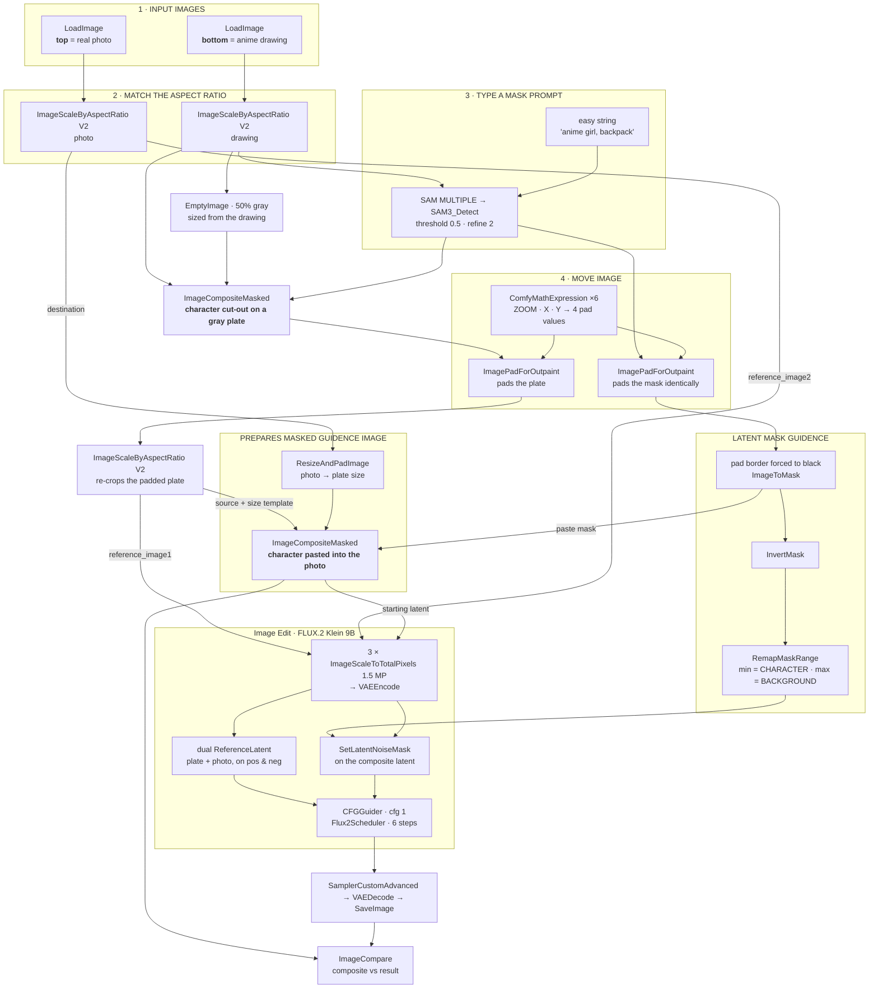

# AnimeIRL-ComfyUI-Workflow

A ComfyUI workflow that takes a drawing — it behaves best on anime art — cuts the character out with **SAM 3.1**, composites them into a real photograph, and uses **FLUX.2 Klein 9B** to relight and blend the two so the result reads as a photo of the character actually standing there.

Inspired by the work of [@auhuheben17](https://x.com/auhuheben17).

**Workflow file:** `simple_anime_composite_v8.json`

<sub>Name candidates, if *Reverse Isekai* isn't your taste: **Isekai Return**, **Cel to Camera**, **Photobomb**, **On Location**, **Live Action Pass**, **Ink → Lens**.</sub>

---

## Table of contents

- [What it does](#what-it-does)
- [Requirements](#requirements)
- [Models](#models)
- [Custom node packs](#custom-node-packs)
- [Graph layout](#graph-layout)
- [How it works](#how-it-works)
- [Step by step](#step-by-step)
- [Parameter reference](#parameter-reference)
- [Prompting](#prompting)
- [Known quirks](#known-quirks)
- [Credits](#credits)

---

## What it does

The character is never regenerated from scratch. SAM masks them out of the drawing, you position them by hand over the photo with three number widgets, and the two images are composited **before** anything is sampled. Flux receives that composite as its starting latent, plus both source images as references, and a per-region denoise map that says exactly how much it is allowed to touch the character versus the background.

Everything downstream of the mask is denoise-strength control.

---

## Requirements

- **ComfyUI ≥ 0.19.3.** The graph needs native `SAM3_Detect`, the FLUX.2 nodes (`Flux2Scheduler`, `ReferenceLatent`), the newer core image nodes (`ResizeAndPadImage`, `ImageCompare`, `ComfyMathExpression`), and frontend subgraph support. Saved on frontend `1.47.11`, schema `0.4`.
- **~16 GB VRAM** comfortable. Klein 9B fp8 plus the Qwen3-8B fp8 text encoder is roughly 17–18 GB of weights, so 12 GB works with offloading but expect swapping.
- Sampling itself is cheap: **6 steps, CFG 1** on the distilled Klein.

## Models

| Role | File | Folder | Source |
|---|---|---|---|
| Diffusion model | `flux-2-klein-9b.safetensors` (fp8) | `models/diffusion_models/` | [BFL FLUX.2-klein-9b-fp8](https://huggingface.co/black-forest-labs/FLUX.2-klein-9b-fp8) |
| Text encoder | `qwen_3_8b_fp8mixed.safetensors` | `models/text_encoders/` | [Comfy-Org/flux2-klein-9B](https://huggingface.co/Comfy-Org/flux2-klein-9B/blob/main/split_files/text_encoders/qwen_3_8b_fp8mixed.safetensors) |
| VAE | `flux2-vae.safetensors` | `models/vae/` | [Comfy-Org/flux2-dev](https://huggingface.co/Comfy-Org/flux2-dev/blob/main/split_files/vae/flux2-vae.safetensors) |
| Segmentation | `sam3.1_multiplex_fp16.safetensors` | `models/checkpoints/` | [Comfy-Org/sam3.1](https://huggingface.co/Comfy-Org/sam3.1) |

Notes:

- The `CLIPLoader` type is set to **`flux2`** — Qwen3-8B is loaded as the FLUX.2 text encoder, not as a Qwen image model.
- The saved graph points at `flux-2-klein-9b.safetensors` and `modelsss\sam3.1_multiplex_fp16.safetensors`. Both are local names/subfolders — **re-pick them from the dropdowns** after loading, or rename your downloads to match.
- Any Klein 9B variant loads, but 6 steps at CFG 1 assumes the **distilled** checkpoint (or a turbo finetune). On `klein-base`, raise steps and CFG.
- SAM 3.1 is loaded through `CheckpointLoaderSimple`, so it belongs in `checkpoints/`, not in a `sams/` folder.

## Custom node packs

Four packs. Everything else in the graph is ComfyUI core — including `ComfyMathExpression`, `ResizeAndPadImage` and `ImageCompare`, which are recent core additions rather than custom nodes.

| Pack | Nodes used here |
|---|---|
| [ComfyUI-KJNodes](https://github.com/kijai/ComfyUI-KJNodes) | `RemapMaskRange` |
| [rgthree-comfy](https://github.com/rgthree/rgthree-comfy) | `Seed (rgthree)` |
| [ComfyUI-Easy-Use](https://github.com/yolain/ComfyUI-Easy-Use) | `easy string`, `easy indexAnything` |
| [ComfyUI_LayerStyle](https://github.com/chflame163/ComfyUI_LayerStyle) | `LayerUtility: ImageScaleByAspectRatio V2` |

---

## Graph layout

### Groups

| Group | What it does |
|---|---|
| `1 - INPUT IMAGES` | Two `LoadImage` nodes. **Top = background photo, bottom = character drawing.** |
| `2 - MATCH THE ASPECT RATIO` | One `ASPECT RATIO` / `WIDTH` / `HEIGHT` primitive drives **both** images, so the photo and the drawing can never drift out of sync. |
| `3 - TYPE A MASK PROMPT` | The text prompt fed to SAM 3.1. |
| `4 - MOVE IMAGE` | ZOOM / X / Y placement of the cut-out over the frame. |
| `LATENT MASK GUIDENCE` | CHARACTER / BACKGROUND denoise-strength dials. |
| `RUN FLUX` | Prompt, sampler, decode, save, before/after compare. |

### Subgraphs

| Subgraph | Contents |
|---|---|
| `Image Edit (Flux.2 Klein 9B)` | 21 nodes — loaders, dual `ReferenceLatent` conditioning on both positive and negative, a third encode path for the composite, `SetLatentNoiseMask`, `Flux2Scheduler`, `CFGGuider`. Exposes NOISE / GUIDER / SAMPLER / SIGMAS / LATENT / VAE. |
| `PREPARES MASKED GUIDENCE IMAGE` | 3 nodes — `GetImageSize` → `ResizeAndPadImage` → `ImageCompositeMasked`. Fits the photo to the plate's dimensions and pastes the character into it. This is the image Flux actually starts from. |
| `SAM MULTIPLE` | Splits SAM's mask batch into 5 indexed slots via `easy indexAnything` + `RemapMaskRange`. Only slot 0 is wired up. |
| `Image Segmentation (SAM3)` | `CheckpointLoaderSimple` → `CLIPTextEncode` → `SAM3_Detect`. Nested inside `SAM MULTIPLE`. |

---

## How it works



### The short version

1. **Both images are forced to the same aspect ratio.** A single `ASPECT RATIO` primitive feeds every `ImageScaleByAspectRatio V2` node, so the photo and the drawing are cropped to matching proportions in one place.
2. **SAM 3.1 segments the character** from a plain-text prompt (`anime girl, backpack`). The mask goes two places: it cuts the character out, and it becomes the denoise map later.
3. **The cut-out is pasted onto a flat 50% gray plate** (`EmptyImage`, colour `#808080`). Gray matters — `ImagePadForOutpaint` also fills with 50% gray, so the plate and its padding are seamless.
4. **ZOOM / X / Y become four pad amounts.** The math is `pad = dimension × (ZOOM / 1000)`, then `left = dx + X`, `right = dx − X`, `top = dy + Y`, `bottom = dy − Y`. Padding the plate shrinks the character inside a larger frame (zoom out) and slides them around. The mask is padded with **the exact same four values**, so it stays locked to the character.
5. **The padded mask is cleaned up.** The pad border is composited to black so it counts as background, giving a clean binary mask: character = 1, everything else = 0.
6. **The photo and the character are composited for real.** `PREPARES MASKED GUIDENCE IMAGE` resizes the photo to the padded plate's dimensions and pastes the character in through that mask. This composite is what gets VAE-encoded into the **starting latent** — so Flux begins from an image that already has the right framing, the right background, and the character in place.
7. **`RemapMaskRange` turns the mask into a denoise map.** After `InvertMask`, `CHARACTER` sets the value of the character region and `BACKGROUND` sets the value of everything else. This feeds `SetLatentNoiseMask`, so those two numbers are literally *how much is Flux allowed to change here*.
8. **Flux gets two references on top of that.** `reference_image1` is the character plate, `reference_image2` is the photo. Both are scaled to 1.5 MP and chained through `ReferenceLatent` on the positive **and** the negative conditioning.
9. **6 steps, CFG 1, euler**, `Flux2Scheduler` shifted by the actual working resolution → decode → save → `ImageCompare` shows the raw composite against the finished render on a slider.

The `ImageBlend` at 50% is a cheap alignment preview: it overlays the photo and the positioned plate so you can eyeball placement before spending a generation.

---

## Step by step

1. **Load the workflow**, then re-select all four models from their dropdowns (the saved paths are local).
2. **Load your images** in group 1 — photo in the *top* `LoadImage`, drawing in the *bottom* one.
3. **Set the aspect ratio** in group 2. One widget covers both images; `3:4` by default, `fit` stays on `crop`. Pick the ratio your photo is closest to, or you'll crop something important out of it.
4. **Type your mask prompt** in group 3 — comma-separated nouns describing what SAM should grab, including anything attached to the character: `anime girl, backpack`, `boy, skateboard, hat`. Queue once and check the mask preview inside the SAM subgraph.
5. **Position the character.** Adjust `ZOOM`, `X`, `Y`, then manually refresh the preview node (click the node, hit the ▶ button on it) until the framing looks right.
   - Bigger `ZOOM` → character smaller in frame.
   - `X` positive → moves right. `Y` positive → moves down.
   - Keep `|X| < dx` and `|Y| < dy`, otherwise a pad value goes negative and the node errors. Raise `ZOOM` to get more room to move.
6. **Set the denoise dials** in `LATENT MASK GUIDENCE`. Start at `CHARACTER = 1` / `BACKGROUND = 1` and pull `CHARACTER` down toward `0` if Flux keeps mangling the face.
7. **Write the prompt** in the Flux node (see below).
8. **Queue.** Reroll with the `Seed (rgthree)` node. Output lands in `output/` with the `SaveImage` prefix, and the `ImageCompare` node gives you a before/after slider against the raw composite.

---

## Parameter reference

| Node / widget | Default | What it does |
|---|---|---|
| `ASPECT RATIO` | `3:4` | Drives all three aspect-ratio nodes. Set to `custom` to use `WIDTH` / `HEIGHT`. |
| mask prompt (`easy string`) | `anime girl, backpack` | SAM 3.1 text query. List every attached object. |
| `threshold` (SAM) | `0.5` | Lower = grabs more, at the cost of halo. |
| `refine_iterations` (SAM) | `2` | Mask edge refinement passes. |
| `ZOOM` | `286` | Pad as ‰ of each dimension. Higher = character smaller. |
| `X` | `166` | Horizontal offset in px. Positive = right. |
| `Y` | `201` | Vertical offset in px. Positive = down. |
| `CHARACTER` | `1.0` | Denoise strength inside the mask. `0` = frozen, `1` = Flux may redraw them. |
| `BACKGROUND` | `1.0` | Denoise strength outside the mask. |
| `megapixels` | `1.5` | Working resolution for all three encodes. Drives VRAM and output size. |
| `steps` | `6` | Distilled Klein. |
| `cfg` | `1.0` | Distilled Klein — the negative prompt is empty and inert at CFG 1. |
| `sampler` | `euler` | |

**The two dials that matter most:** `CHARACTER` and `BACKGROUND`. As the note in the graph says — *0 keeps the original, 1 lets Flux change it, leave both at 1 to give the AI full access.*

- Dropping `CHARACTER` to roughly `0.2–0.5` preserves the drawing's linework and face while still letting the model relight the edges, so the cut-out stops looking pasted on.
- Because the starting latent is now the real composite rather than a flat gray plate, middle values on `BACKGROUND` are meaningful too: lower it if you want the photo to survive the pass more or less untouched, keep it at `1` if you want Flux to rebuild the scene around the character.

---

## Prompting

`reference_image1` is the character plate, `reference_image2` is the photo. The shipped prompt is a good template:

```
change the background of the image 1, without making any changes to subject.
a anime girl with roller skates is sitting on the grass in front of a gray
volkswagen beetle, backlit by the sun. make changes only to image 2,
Maintain consistency in character facial features and hairstyles.
do not change the pose.
```

The pattern:

1. Tell it which image to edit and what to leave alone.
2. Describe the **whole finished scene** in one sentence — subject, setting, and the lighting direction.
3. Add the identity locks: *maintain consistency in character facial features and hairstyles*, *do not change the pose*.

Lighting is what sells the composite. Naming it explicitly (`backlit by the sun`, `overcast, soft shadows`, `warm streetlight from the left`) does more than the mask settings do.

---

## Known quirks

- Several `PreviewImage` nodes are wired as **pass-through relays**, not just previews. They have to be refreshed manually to update the placement preview.
- `SAM MULTIPLE` exposes 5 mask slots; slots 1–4 are remapped to `0,0` and go nowhere. Only slot 0 (the union of all detections) is used, with `individual_masks` off.
- The third `ImageScaleByAspectRatio V2` re-crops the padded plate before it reaches Flux, while the mask goes to the composite subgraph un-recropped. The padding is proportional to each dimension, so the two normally stay the same size — if you ever hand-edit the pad math, expect a size mismatch here first.
- The `SaveImage` prefix still reads `Flux2-Klein-4b-base` — cosmetic leftover from an earlier 4B version.
- The `width` / `height` widgets on `Flux2Scheduler` (1024×1024) are overridden by `GetImageSize` after the 1.5 MP rescale. One `EmptyImage` below the pad group is orphaned and safe to delete.
- The `UNETLoader` default stored inside the subgraph names a community turbo finetune; the value promoted to the parent node is what actually loads.

---

## Credits

- Technique inspired by [@auhuheben17](https://x.com/auhuheben17).
- [FLUX.2 Klein](https://huggingface.co/black-forest-labs) — Black Forest Labs.
- [SAM 3.1](https://huggingface.co/facebook/sam3.1) — Meta.
- Repackaged ComfyUI weights by [Comfy-Org](https://huggingface.co/Comfy-Org).

Check the upstream repositories for the licence terms covering each model.
